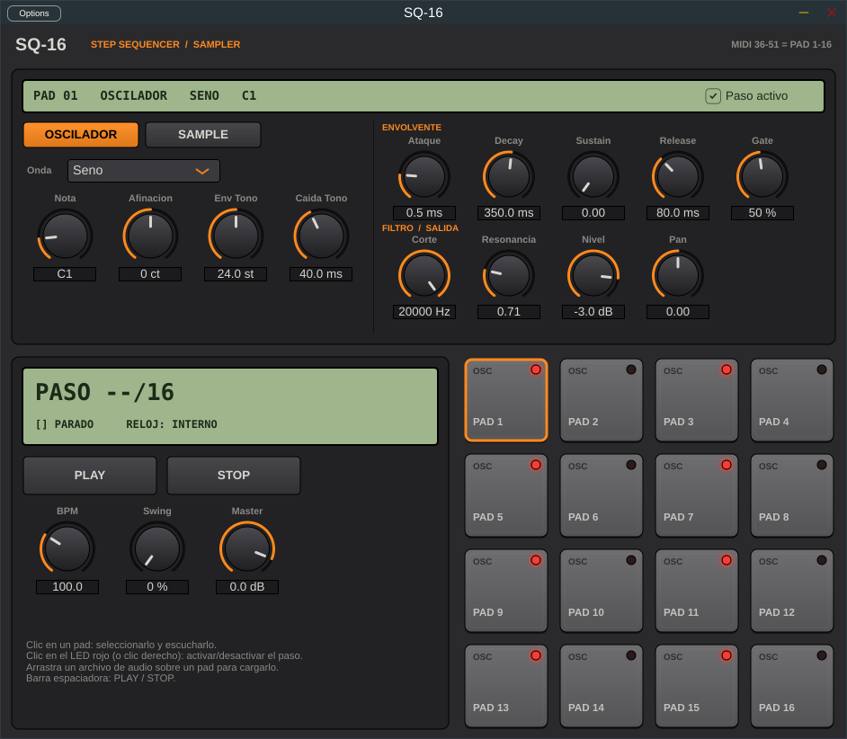

# SQ-16 · Secuenciador 4x4 (VST3 + Standalone)



## Qué hace este primer prototipo

- **16 pads (4x4)**, cada uno es un paso de la secuencia (semicorcheas, el pad 1 es el primer paso).
- **Cada pad es independiente**: tiene su propio sonido y sus propios ajustes.
- **Al hacer clic en un pad** se selecciona (borde naranja), suena, y arriba aparecen sus ajustes:
  - Pestaña **OSCILADOR**: onda (seno, sierra, cuadrada, triángulo, ruido), nota, afinación y una
    "envolvente de tono" (sirve para hacer bombos y efectos).
  - Pestaña **SAMPLE**: cargar un audio (WAV, AIFF, FLAC, OGG...), punto de inicio y tono.
  - La pestaña que eliges es la que suena en ese pad.
  - Siempre visibles: envolvente (Ataque, Decay, Sustain, Release, Gate), filtro (Corte, Resonancia), Nivel y Pan.
- **LED rojo** de cada pad = el paso está activo en la secuencia. Clic en el LED (o clic derecho) para encenderlo/apagarlo.
- **Arrastrar un audio** desde tu ordenador encima de un pad lo carga directamente.
- **PLAY / STOP**, BPM, Swing y volumen Master. La barra espaciadora también hace PLAY/STOP.
- **Dentro de un DAW** (Ableton, FL Studio, Reaper...), cuando el DAW reproduce, el secuenciador
  se sincroniza solo con su tempo. Las notas MIDI 36 a 51 (C1 a D#2) disparan los pads 1 a 16.
- Todo se guarda con el proyecto del DAW (ajustes y la ruta de los samples).

Viene con un ritmo de ejemplo: bombo en los pasos 1, 5, 9, 13 y charles en 3, 7, 11, 15.

## Qué hay en la carpeta

| Archivo | Para qué sirve |
|---|---|
| `CMakeLists.txt` | La "receta" que dice cómo construir el plugin |
| `Source/PluginProcessor.*` | El motor: el reloj del secuenciador y el sonido |
| `Source/PadVoice.h` | El sonido de un pad (oscilador, sample, filtro, envolvente) |
| `Source/PluginEditor.*` | La interfaz: pads, mandos y pantallas |
| `Source/Params.h` | La lista de ajustes de cada pad |

## Cómo construirlo (compilar) en tu ordenador

"Compilar" es convertir este código en un programa que puedes abrir. Solo hay que instalar
herramientas una vez; después son dos comandos.

### Windows

1. Instala **Visual Studio 2022 Community** (gratis): https://visualstudio.microsoft.com/es/
   En el instalador marca **"Desarrollo para el escritorio con C++"** (incluye CMake).
2. Instala **Git**: https://git-scm.com/download/win (todo con las opciones por defecto).
3. Copia la carpeta `secuenciador` a tu ordenador, por ejemplo a `C:\SQ16`.
4. Abre desde el menú Inicio **"Developer PowerShell for VS 2022"** y escribe:
   ```
   cd C:\SQ16
   cmake -B build
   cmake --build build --config Release
   ```
   La primera vez tarda varios minutos (descarga JUCE y compila todo).
5. Resultado:
   - Standalone: `build\SQ16_artefacts\Release\Standalone\SQ-16.exe` (doble clic para abrir).
   - Plugin: copia `build\SQ16_artefacts\Release\VST3\SQ-16.vst3` a `C:\Program Files\Common Files\VST3\`
     y vuelve a escanear plugins en tu DAW.

### Mac

1. Instala **Xcode** desde la App Store y ábrelo una vez para aceptar la licencia.
2. Instala **CMake**: https://cmake.org/download/ (y en el programa CMake, menú *Tools > How to Install For Command Line Use*).
3. Abre la app **Terminal**, ve a la carpeta y escribe:
   ```
   cd ~/Desktop/secuenciador
   cmake -B build -G Xcode
   cmake --build build --config Release
   ```
4. Resultado:
   - Standalone: `build/SQ16_artefacts/Release/Standalone/SQ-16.app`
   - Plugin: copia `build/SQ16_artefacts/Release/VST3/SQ-16.vst3` a `~/Library/Audio/Plug-Ins/VST3/`

### En el Standalone

Si no oyes nada, pulsa **Options** (arriba a la izquierda) > *Audio/MIDI Settings* y elige tu
tarjeta de sonido / salida de audio.

## Nota sobre JUCE

El plugin usa JUCE 8 (la librería estándar para hacer plugins de audio). Para uso personal y
proyectos de código abierto es gratis; si algún día quieres venderlo hace falta su licencia comercial.
